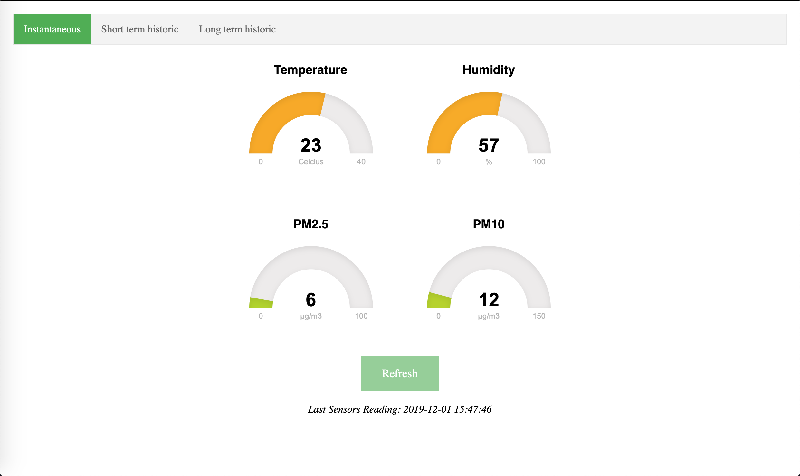
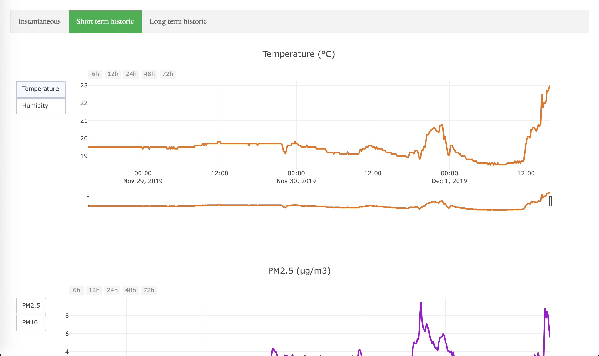
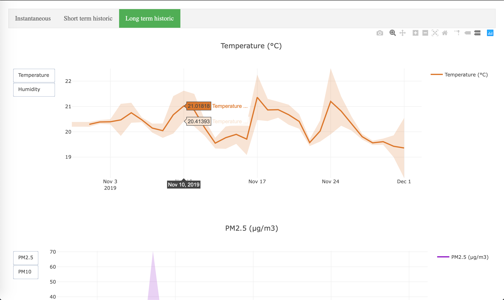

# indoor-station

The idea of this project is to collect data using sensors connected to a Raspberry Pi, and display it on a small web app built using Flask. The present work includes a sensor for temperature and humidity, and a sensor for particulate matter PM2.5/PM10.

## Hardware: Raspberry Pi based device to get data

Data acquisition is made with a small setup based on a [Raspberry Pi](https://www.raspberrypi.org) micro-controller. The list of required material to complete the project is the following:

* Raspberry Pi 3 model B
* A power charger (preferably 5V 3000mA)
* A SD card, 32 Go is a good choice as the acquired data is relatively light
* A DHT22 sensor for temperature and humidity (see [here](https://www.amazon.fr/AZDelivery-AM2302-Capteur-température-dhumidité-microcontrôleurs/dp/B078SVZB1X/ref=sr_1_1?__mk_fr_FR=ÅMÅŽÕÑ&crid=1QS7XJ9TRZORH&keywords=dht22&qid=1574713036&sprefix=DHT+%2Caps%2C131&sr=8-1) for instance)
*  A SDS011 sensor for PM2.5/PM10 particulate matter (see [here](https://www.amazon.fr/gp/product/B0769F81XS/ref=ppx_yo_dt_b_asin_title_o05_s00?ie=UTF8&psc=1)

## Web application: Flask based server on the RPi

The collected data is exposed in a nice way using a small web application based on Python and its Flask library. The server is hosted by the Raspberry Pi and made accessible only from local network at home. 

Three pages have been created:

* The first page shows the last data measures for temperature, humidity, PM10 and PM2.5.
* The second page shows the evolution of these quantities over the past 3 days.
* The third and last page represents the evolution of daily averaged data over past months. The standard deviation is also shown for each dataset.

**README IS IN WORK-IN-PROGRESS**
